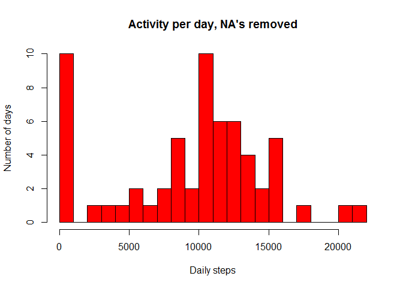
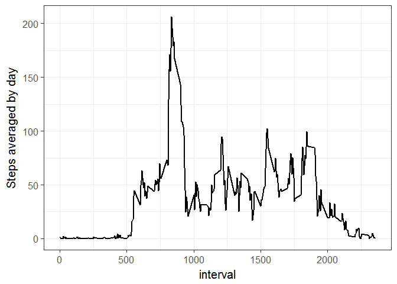
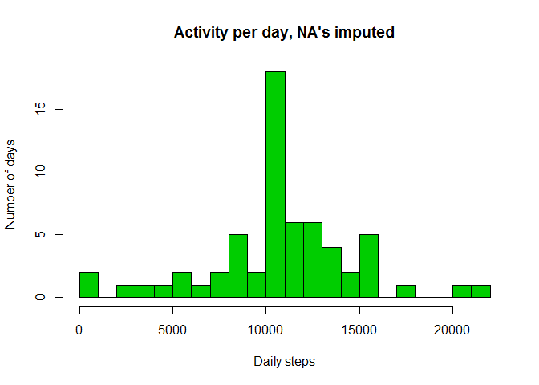
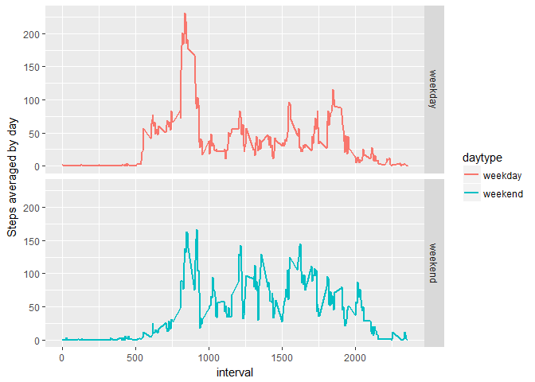

# Reproducible Research: Peer Assessment 1


## Loading and preprocessing the data

Read the data directly from the .zip and convert date from char to Date

```r
activity <- read.csv(unz("activity.zip", "activity.csv"))
activity$date <- as.Date(activity$date)
```


## What is mean total number of steps taken per day?

We ignore the NA's for now.

Group the activity data by date, get the daily totals, and plot histogram:

```r
library(dplyr)
daily_activity <- activity %>%
    group_by(date) %>%
    summarize(steps = sum(steps, na.rm=TRUE))
hist(daily_activity$steps, breaks = 20, xlab="Daily steps", col = 2,
     main = "Activity per day, NA's removed", ylab="Number of days")
```

<!-- -->

Get the mean and median:

```r
mean(daily_activity$steps, na.rm = TRUE)
```

```
## [1] 9354.23
```

```r
median(daily_activity$steps, na.rm = TRUE)
```

```
## [1] 10395
```


## What is the average daily activity pattern?

Group data by interval, calculate means of steps in each interval, and plot
the means:

```r
interval_activity <- activity %>%
    group_by(interval) %>%
    summarize(meansteps = mean(steps, na.rm=TRUE))

library(ggplot2)
ggplot(interval_activity, aes(x=interval, y=meansteps)) + 
    ylab("Steps averaged by day") + 
    geom_line(lwd=1) + 
    theme_bw(base_size=15)
```

<!-- -->

Get the interval corresponding to the maximum steps:

```r
index <- which.max(interval_activity$meansteps)
interval_activity[index, ]
```

```
## # A tibble: 1 × 2
##   interval meansteps
##      <int>     <dbl>
## 1      835  206.1698
```


## Imputing missing values

Number of missing values:

```r
# Index vector of NA's:
NAidx <- is.na(activity$steps)
sum(NAidx)
```

```
## [1] 2304
```

Impute the missing values with 5 min averages we calculated previously:

```r
# Index vector of data in interval_activity corresponding to NA's in activity
NAint <- match(activity[NAidx,"interval"], interval_activity$interval)
# Impute the values:
activity_imputed <- activity
activity_imputed[NAidx, "steps"] <- interval_activity[NAint,"meansteps"]
```

Repeat the previous analysis with imputed values:

Group the activity data by date, get the daily totals, and plot histogram:

```r
daily_activity <- activity_imputed %>%
    group_by(date) %>%
    summarize(steps = sum(steps))
hist(daily_activity$steps, breaks = 20, xlab="Daily steps", col = 3,
     main = "Activity per day, NA's imputed", ylab="Number of days")
```

<!-- -->

Get the mean and median:

```r
mean(daily_activity$steps)
```

```
## [1] 10766.19
```

```r
median(daily_activity$steps)
```

```
## [1] 10766.19
```

The values are higher than previously and the mean and median are now identical. 
This is mainly because the days with only NA values have all been replaced with 
the same value.

## Are there differences in activity patterns between weekdays and weekends?

Add variables weekday and daytype (weekday, weekend) to dataset with imputed data:

```r
# Add weekday variable
activity_imputed$weekday <- weekdays(activity_imputed$date)
# Logical vector for whether data point belongs to weekend:
is_weekend <- activity_imputed$weekday %in% c("Saturday", "Sunday")
# Make new variable daytype and assign values:
activity_imputed[is_weekend,"daytype"] = "weekend"
activity_imputed[!is_weekend,"daytype"] = "weekday"
# Turn into factor:
activity_imputed$daytype <- as.factor(activity_imputed$daytype)
```

Take averages by daytype and plot the data:

```r
interval_activity <- activity_imputed %>%
    group_by(interval, daytype) %>%
    summarize(meansteps = mean(steps, na.rm=TRUE))

library(ggplot2)
ggplot(interval_activity, aes(x=interval, y=meansteps)) + 
    ylab("Steps averaged by day") +
    facet_grid(daytype~.) + 
    geom_line(lwd=1, aes(col=daytype))
```

<!-- -->


